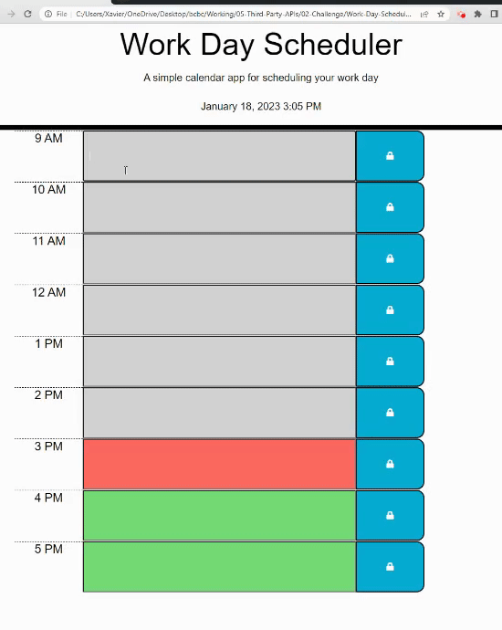

# Week05-Challenge

## Description:

The purpose of this exercise is to build a work day planner based on standard business hours where the current date and time are displayed. The timeblocks are color-coded to indicate whether an event is in the past, present or future. The entered schedule is then saved in local storage upon clicking the save button and persists even when the page is refreshed.

### Screenshot:

### Links:

https://xvrteo.github.io/Work-Day-Scheduler/

https://github.com/XvrTeo/Work-Day-Scheduler
